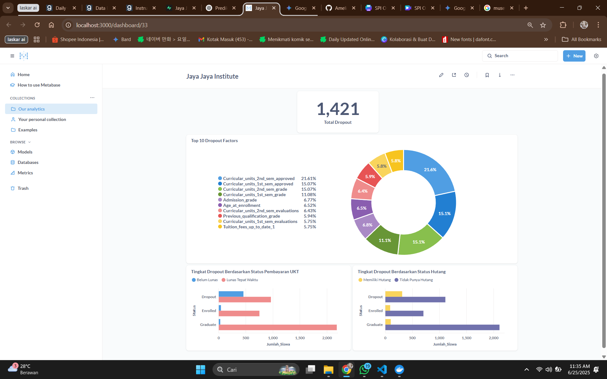

# Submission Akhir: Menyelesaikan Permasalahan Institusi Pendidikan

## Business Understanding

**Jaya Jaya Institut** merupakan salah satu institusi pendidikan perguruan tinggi yang telah berdiri sejak tahun 2000. Hingga saat ini, ia telah mencetak banyak lulusan dengan reputasi yang sangat baik. Akan tetapi, terdapat banyak juga siswa yang tidak menyelesaikan pendidikannya alias **dropout**.

Jumlah dropout yang tinggi ini tentunya menjadi salah satu masalah yang besar untuk sebuah institusi pendidikan. Oleh karena itu, Jaya Jaya Institut ingin mendeteksi secepat mungkin siswa yang mungkin akan melakukan dropout sehingga dapat diberi bimbingan khusus untuk mencegah hal tersebut.

## Permasalahan Bisnis

Berdasarkan analisis data dari dataset yang diberikan, tingkat *dropout* mahasiswa mencapai **32,12%** (1.421 dari 4.424 mahasiswa). Angka ini sangat signifikan dan memerlukan perhatian serius.

Permasalahan utama yang akan diselesaikan adalah:
- Mengidentifikasi faktor-faktor kunci (akademik, finansial, demografis) yang paling signifikan yang mendorong mahasiswa untuk *dropout*.
- Membangun model prediktif yang dapat mengidentifikasi mahasiswa berisiko tinggi sejak dini.
- Merumuskan rekomendasi dan langkah-langkah yang dapat diimplementasikan oleh pihak institut untuk menekan angka *dropout*.

## Cakupan Proyek

Cakupan dari proyek ini adalah sebagai berikut:
- Melakukan analisis data eksplorasi (EDA) untuk memahami distribusi dan hubungan antar variabel dalam dataset mahasiswa.
- Menerapkan beberapa model klasifikasi seperti **Logistic Regression**, **Random Forest Classifier**, dan **XGBoost** untuk memprediksi status mahasiswa (*Dropout*, *Enrolled*, *Graduate*).
- Menggunakan model **Random Forest Classifier** untuk mengidentifikasi dan mengukur tingkat kepentingan dari setiap fitur yang berpotensi mempengaruhi status kelulusan mahasiswa.
- Membuat visualisasi data dan dashboard interaktif menggunakan **Metabase** untuk menyajikan faktor-faktor paling berpengaruh terhadap *dropout*.
- Menyusun rekomendasi strategis yang dapat diimplementasikan oleh pihak akademik untuk mengurangi tingkat *dropout*.

## Persiapan

**Sumber Data**:
- **Dataset**: Dataset yang digunakan dalam proyek ini adalah **Predict students' dropout and academic success** dari Dicoding. Anda dapat mengaksesnya melalui [tautan berikut](https://github.com/dicodingacademy/dicoding_dataset/tree/main/students_performance).
- **Notebook Analisis**: Analisis lengkap terdapat pada file `BPDS_2_ameliagizela2711.ipynb`.

**Setup Environment**:
- **Instalasi Package via Requirements.txt**
  - **Setup Environment - Anaconda**
    ```bash
    conda create --name main-ds python=3.9
    conda activate main-ds
    pip install -r requirements.txt
    ```
  - **Setup Environment - Shell/Terminal**
    ```bash
    pip install pipenv
    pipenv install
    pipenv shell
    pip install -r requirements.txt
    ```

- **Akses Dashboard Metabase**
  **Prasyarat:**
    - [Docker](https://www.docker.com/products/docker-desktop/) terinstal dan sedang berjalan.
    - Repository ini telah di-clone ke mesin lokal Anda.

  Untuk mengakses dashboard yang telah dikonfigurasi, ikuti tahapan berikut:
  1.  **Verifikasi File Database**
      Pastikan file database Metabase, yaitu `metabase.db.mv.db`, terdapat pada direktori utama proyek ini.

  2.  **Jalankan Metabase via Docker**
      Buka terminal atau command prompt Anda, lalu jalankan perintah berikut.
      ```bash
      docker run -d -p 3000:3000 \
        -v "$(pwd)/metabase.db.mv.db:/metabase.db/metabase.db.mv.db" \
        --name metabase-proyek \
        metabase/metabase
      ```

  3.  **Tunggu Metabase Siap**
      Metabase memerlukan waktu sekitar 1-3 menit untuk inisialisasi. Anda bisa melihat log-nya dengan perintah:
      ```bash
      docker logs -f metabase-proyek
      ```
      Tunggu hingga Anda melihat pesan seperti `Metabase initialization COMPLETE`. Tekan `Ctrl + C` untuk keluar dari log.

  4.  **Akses Dashboard**
      Buka browser Anda dan kunjungi alamat: [**http://localhost:3000**](http://localhost:3000)

  5.  **Login ke Metabase**
      Gunakan kredensial berikut untuk masuk:
      -   **Email:** `root@mail.com`
      -   **Password:** `root123`

## Business Dashboard

Dashboard **Jaya Jaya Institut** dikembangkan menggunakan **Metabase** untuk membantu tim akademik memantau indikator-indikator utama terkait performa dan risiko *dropout* mahasiswa secara visual dan interaktif.

### Fitur Dashboard

Dashboard ini menyajikan beberapa visualisasi penting:
- **Total Mahasiswa Dropout**: Menampilkan indikator utama jumlah mahasiswa yang *dropout* secara ringkas, yaitu **1.421** orang.
- **Top 10 Faktor Paling Berpengaruh**: Diagram donat yang menunjukkan 10 faktor teratas yang paling berkontribusi terhadap status mahasiswa, berdasarkan model Random Forest. Faktor-faktor ini antara lain:
  - Jumlah SKS yang Lulus di Semester 2 (*Curricular units 2nd sem approved*)
  - Jumlah SKS yang Lulus di Semester 1 (*Curricular units 1st sem approved*)
  - Nilai Rata-rata Semester 2 dan 1
  - Usia saat Mendaftar (*Age at enrollment*)
  - Status Pembayaran UKT (*Tuition fees up to date*)
- **Tingkat Dropout Berdasarkan Status Pembayaran UKT**: Grafik batang yang membandingkan status kelulusan mahasiswa yang lunas dan belum lunas UKT.
- **Tingkat Dropout Berdasarkan Status Hutang**: Grafik batang yang menunjukkan status kelulusan antara mahasiswa yang memiliki tanggungan utang dan yang tidak.

### Tujuan Penggunaan

Dashboard ini bertujuan untuk:
- Memberikan *insight* visual terhadap pola akademik dan finansial yang berujung pada *dropout*.
- Mendukung keputusan strategis pihak akademik dalam memberikan intervensi dini.
- Menyediakan data yang mudah diakses dan dipahami oleh manajemen non-teknis.

### Screenshot



## Conclusion

Analisis data dan pemodelan menggunakan **Random Forest** menunjukkan bahwa performa akademik dan kondisi finansial adalah prediktor terkuat untuk kasus *dropout* di Jaya Jaya Institut. Model mencapai akurasi sekitar **77%** dalam memprediksi status mahasiswa.

Berdasarkan analisis **feature importance**, faktor-faktor yang paling signifikan adalah:
1.  **Jumlah SKS Lulus di Semester 2 (`Curricular_units_2nd_sem_approved`)**: Faktor paling dominan, menunjukkan bahwa performa di semester kedua sangat krusial.
2.  **Jumlah SKS Lulus di Semester 1 (`Curricular_units_1st_sem_approved`)**: Performa awal di semester pertama juga menjadi indikator kuat.
3.  **Nilai Rata-rata Semester 2 & 1 (`..._grade`)**: Nilai akademik secara langsung berkorelasi kuat dengan kelanjutan studi.
4.  **Status Pembayaran UKT (`Tuition_fees_up_to_date`)**: Mahasiswa yang menunggak pembayaran UKT memiliki kecenderungan *dropout* yang sangat tinggi.
5.  **Usia saat Mendaftar (`Age_at_enrollment`)**: Usia juga menjadi salah satu faktor demografis yang berpengaruh.

## Rekomendasi Action Items

Berdasarkan kesimpulan di atas, berikut adalah rekomendasi yang dapat diimplementasikan oleh Jaya Jaya Institut:
- **Menerapkan Sistem Peringatan Dini Akademik**:
  - **Aksi**: Buat sistem otomatis yang memonitor mahasiswa dengan jumlah SKS lulus dan nilai rata-rata di bawah ambang batas tertentu di akhir setiap semester.
  - **Tujuan**: Mahasiswa yang teridentifikasi dalam sistem ini harus segera dihubungi oleh dosen wali atau konselor akademik untuk mendapatkan bimbingan intensif, program tutorial, atau kelas tambahan.
- **Program Bantuan dan Konseling Finansial Proaktif**:
  - **Aksi**: Jangan menunggu mahasiswa menunggak. Buat program untuk menjangkau mahasiswa yang memiliki kesulitan finansial sebelum tenggat waktu pembayaran UKT.
  - **Tujuan**: Tawarkan opsi cicilan, informasi beasiswa, atau bantuan dana darurat. Dashboard menunjukkan bahwa mahasiswa yang tidak membayar UKT tepat waktu adalah kelompok risiko tertinggi kedua.
- **Mentorship dan Dukungan untuk Mahasiswa Baru**:
  - **Aksi**: Mengingat pentingnya performa di semester 1 dan 2, buat program mentorship yang memasangkan mahasiswa baru dengan mahasiswa senior atau dosen.
  - **Tujuan**: Membantu adaptasi mahasiswa baru, baik secara akademik maupun sosial, sehingga mereka dapat memulai perjalanan studi mereka dengan baik.
- **Program Dukungan Khusus Berdasarkan Demografi**:
  - **Aksi**: Karena usia menjadi salah satu faktor, analisis lebih lanjut perlu dilakukan. Institut dapat membuat program dukungan yang berbeda untuk mahasiswa yang lebih muda (misalnya, dukungan adaptasi sosial) dan mahasiswa yang lebih tua (misalnya, jadwal fleksibel atau dukungan karir).